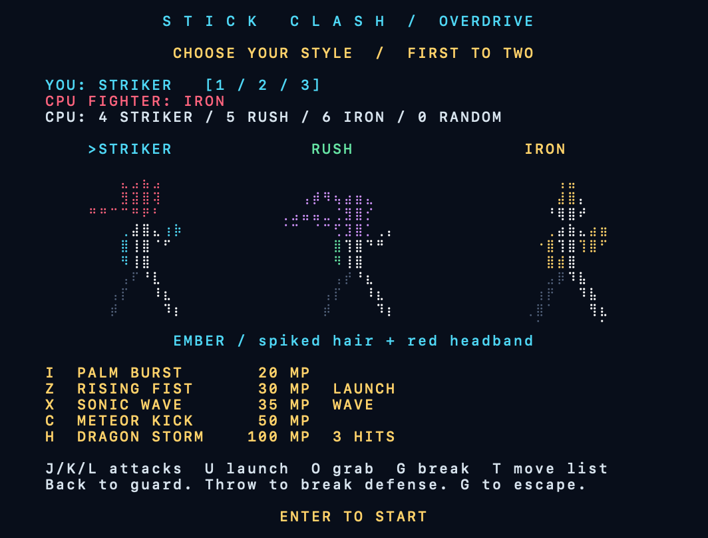
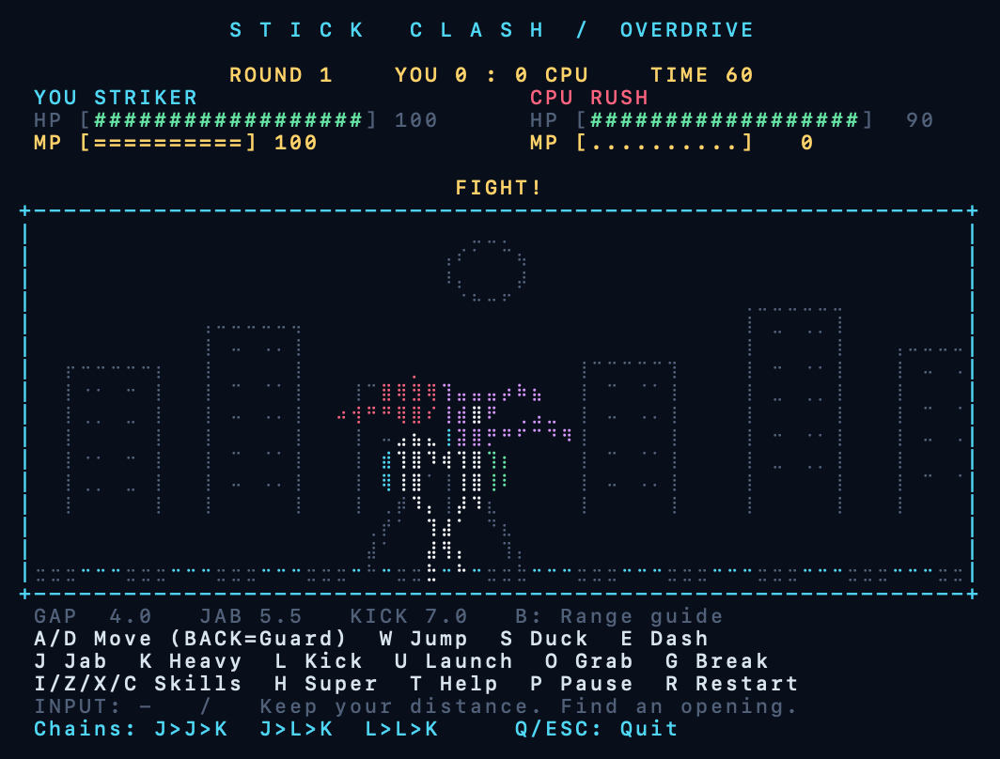
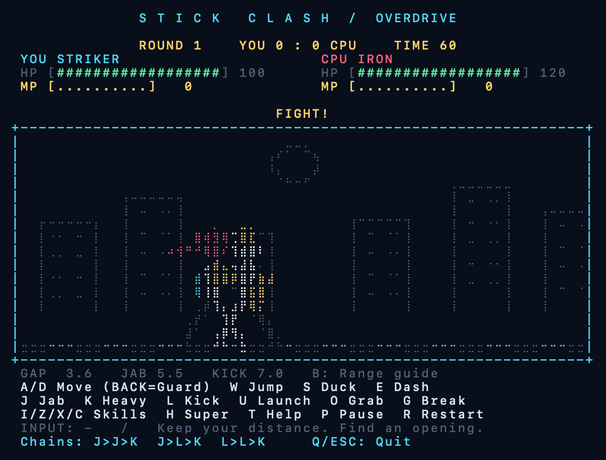

# 🎮 Terminal Minigames

터미널에서 즐기는 **똥피하기 · 우주선 슈팅 · 피카츄풍 배구 · 아이템 벽돌깨기 · 졸라맨 격투**. 게임을 폴더 단위로 추가하는 플러그인 방식의 작은 오락실입니다.

Python 표준 라이브러리만 사용하므로 별도 패키지 설치가 필요 없습니다.

## 준비 사항

- macOS 또는 Linux의 키보드 입력이 가능한 터미널
- Python **3.9 이상**: `python3 --version`으로 확인
- 터미널 크기 **66칸 × 33줄 이상** 권장
- Windows에서는 WSL의 Linux 터미널을 사용하세요. Windows 기본 Python은 지원 대상이 아닙니다.

게임은 문자 화면으로 실행됩니다. 격투게임은 Unicode 점자(Braille)를 사용해 한 글자 안에 **2×4개의 점**으로 팔다리와 이펙트를 그립니다. 점자 문자를 지원하는 고정폭 글꼴을 사용하세요. 배구는 원작 이미지·음원을 사용하지 않는 피카츄 배구풍 팬 게임입니다.

## 빠른 시작

```sh
git clone https://github.com/Teal-ios/TerminalMinigames.git
cd TerminalMinigames
./arcade
```

번호 또는 게임 ID를 입력해 선택하세요. 게임 종료 후에는 셸로 돌아옵니다.

```sh
./arcade list     # 게임 목록
./arcade poop     # 똥피하기
./arcade space    # 우주선 슈팅
./arcade volley   # 피카츄풍 배구
./arcade breakout # 랜덤 아이템 벽돌깨기
./arcade fight    # 졸라맨 격투: 캐릭터 선택, 콤보, 잡기
./arcade --help   # 도움말
```

현재 작업 폴더에서는 다음과 같이 실행합니다.

```sh
cd /Users/runningpoint/Desktop/Test
./arcade
```

실행 권한이 없는 환경에서는 `python3 arcade`도 가능합니다.

## 어느 폴더에서나 `arcade`로 실행

저장소 폴더에서 다음 명령을 실행하면 **현재 터미널 세션**에서 사용할 수 있습니다.

```sh
export PATH="$PWD:$PATH"
arcade list
arcade space
```

새 터미널에서도 사용하려면 셸 설정 파일(macOS 기본 셸: `~/.zshrc`, Bash: `~/.bashrc`)에 **실제 저장소 절대 경로**를 추가하고 새 터미널을 여세요. 현재 작업 위치의 예시:

```sh
export PATH="/Users/runningpoint/Desktop/Test:$PATH"
```

저장소 위치를 옮기면 설정된 경로도 바꿔주세요.

## 조작법

공통: **R** 다시 시작, **P** 일시정지/계속하기, **Q / Esc / Ctrl+C** 종료.

### 💩 똥피하기 — `arcade poop`

`@`를 움직여 떨어지는 `*`을 피하세요. 생존 시간에 따라 점수가 오르며 12초마다 난이도가 높아집니다. 최고 점수는 해당 실행 중에만 유지됩니다.

| 키 | 동작 |
|---|---|
| Enter / Space | 시작 |
| ← / → 또는 A / D | 이동 |
| Space / P | 일시정지/계속하기 |

최소 화면 크기는 48칸 × 29줄입니다.

### 🚀 우주선 슈팅 — `arcade space`

`/A\`를 조종해 적 `\V/`을 격추하세요. 적당 100점, 500점마다 난이도가 올라갑니다. 목숨은 3개입니다. 적·탄환과 충돌하거나 적을 아래로 놓치면 목숨이 줄며, 피격 후 1.5초간 무적입니다.

| 키 | 동작 |
|---|---|
| Enter | 시작 |
| 방향키 / WASD | 이동 |
| Space | 발사 |
| F | 자동 발사 켜기/끄기 |

터미널에서는 **F로 자동 발사를 켜고 이동**하면 편합니다.

### ⚡ 피카츄풍 배구 — `arcade volley`

긴 귀와 검은 귀 끝, 빨간 볼, 번개 꼬리를 가진 노란 캐릭터로 경기합니다. 왼쪽이 플레이어, 오른쪽 **파란 머리띠**가 컴퓨터입니다. 점프·스파이크·슬라이딩에 따라 자세도 달라집니다.

공 아래로 이동하면 자동으로 받아칩니다. 상대 코트에 공을 떨어뜨려 **5점을 먼저 얻으면 승리**합니다. 벽·천장에서는 공이 튕기고 서브는 자동 진행됩니다.

| 키 | 동작 |
|---|---|
| Enter | 시작 |
| ← / → 또는 A / D | 이동 |
| ↑ / W | 점프 |
| Space (지상) | 마지막 이동 방향으로 슬라이딩 |
| Space (공중) | 스파이크 준비 (0.4초) |

**슬라이딩:** 좌우 방향을 누른 뒤 Space를 누르면 그 방향으로 빠르게 몸을 던져 낮은 공을 받아냅니다. 이동 방향을 누른 적이 없으면 네트 쪽으로 슬라이딩합니다. 약 0.34초간 이동한 뒤 0.18초 동안 일어나며, 이 동안에는 이동·점프·슬라이딩을 다시 할 수 없습니다. 컴퓨터도 낮은 공에 슬라이딩으로 대응합니다.

**스파이크:** ↑/W로 먼저 점프하고, 공에 닿을 순간 Space를 누르세요. 네트보다 높은 위치에서 스파이크하면 공을 아래로 내려칩니다.

지상 다이빙·공중 공격·착지 후 회복이라는 조작 구분은 [원작 재구현의 동작 코드](https://github.com/gorisanson/pikachu-volleyball/blob/master/src/resources/js/physics.js)를 참고했습니다. 이 게임의 물리·시간·그림은 터미널용으로 별도 구현했으며, 동시 키 입력 대신 마지막 이동 방향을 사용합니다.

### 🧱 아이템 벽돌깨기 — `arcade breakout`

패들로 공 `O`를 받아 **벽돌 50개를 모두 깨면 승리**합니다. 벽돌당 10점이며 목숨 3개로 시작합니다. 패들 가장자리에 맞출수록 공이 그 방향으로 크게 튕겨 조준할 수 있습니다.

| 키 | 동작 |
|---|---|
| Enter | 게임 시작 |
| ← / → 또는 A / D | 패들 이동 |
| Space / Enter | 공 발사 / 목숨을 잃은 뒤 재발사 |
| P / R / Q | 일시정지 / 처음부터 / 종료 |

벽돌을 깨면 **30% 확률로 랜덤 아이템**이 떨어집니다. 떨어지는 문자를 **패들로 받아야** 효과가 발동합니다.

| 아이템 | 효과 |
|---|---|
| `2` | 현재 공 개수 2배: 1 → 2 → 4 → 8, 최대 8개 |
| `W` | 패들 확장, 12초 |
| `S` | 모든 공 속도를 65%로 감속, 8초 |
| `+` | 목숨 +1, 최대 5개 |

확장·감속 아이템을 다시 받으면 지속 시간이 갱신됩니다. **공을 모두 놓쳤을 때만 목숨 1개**를 잃으며, 남은 공이 있으면 계속 진행합니다. 목숨을 잃으면 아이템 효과가 해제되고 Space로 다시 발사할 수 있습니다.

### 🥊 졸라맨 격투 — `arcade fight`

**STICK CLASH / OVERDRIVE**는 CPU와 1대1로 싸우는 터미널 격투게임입니다. 캐릭터 3명, 공통 기본기·연속기, **캐릭터마다 고유 기술 4개 + 초필살기 1개**를 제공합니다. 준비 동작, 가드, 공격 후 빈틈, 공중 콤보와 잡기를 활용하세요. 기술 이름과 그림은 자체 구성했습니다.







미리보기는 실제 게임 엔진과 문자 렌더러의 출력을 이미지로 옮긴 것입니다. 시연에서는 CPU 입력을 끄고 MP와 시작 거리를 설정했습니다. 색상과 점자 모양은 사용하는 터미널·글꼴에 따라 달라집니다.

#### 동작과 타격감

- 관절을 움직여 걷기, 점프, 가드, 공격 준비·뻗기·회수, 피격, 잡기와 다운을 표현합니다. 공격 자세 사이를 보간하고 이동에는 가감속을 적용합니다. 머리띠와 스카프도 움직입니다.
- 적중 시 방사형 불꽃, 짧은 히트스톱, 화면 흔들림, 피해 숫자가 나타납니다. 가드에는 방어 링, 대시에는 잔상, 띄우기에는 상승 궤적, 다운에는 바닥 충격을 표시합니다.
- 공격은 **전방의 유효 거리와 높이**가 겹칠 때 맞습니다. 활성 시간 안에 들어온 상대도 맞지만, 지나간 공격이나 뒤쪽의 상대에게는 맞지 않습니다. `B`로 근접 공격 판정 범위를 볼 수 있습니다.
- 공격 준비 중인 상대를 때리면 **COUNTER**가 발생해 피해와 경직이 늘어납니다. 히트스톱 중에도 다음 공격을 입력할 수 있습니다.
- 체력바의 붉은 잔량으로 방금 받은 피해를 확인하고, 콤보 횟수·누적 피해·입력 기록으로 연계를 연습할 수 있습니다.

#### 캐릭터 선택

게임 시작 화면에서 플레이어와 CPU를 **독립적으로 선택**합니다. 같은 캐릭터끼리도 싸울 수 있습니다.

| 선택 | 키 |
|---|---|
| 플레이어 STRIKER / RUSH / IRON | `1` / `2` / `3` |
| CPU STRIKER / RUSH / IRON 직접 지정 | `4` / `5` / `6` |
| CPU 랜덤 선택 (기본값) | `0` |
| 선택 확정 및 경기 시작 | `Enter` |

랜덤 CPU는 경기 시작 시 세 캐릭터 중 한 명으로 정해지며 **경기 내에서는 라운드가 바뀌어도 유지**됩니다. `R`로 재경기하면 플레이어 선택과 CPU 지정 방식은 유지되고, 랜덤 CPU는 다시 뽑습니다. 캐릭터 설정을 바꾸려면 `Q`로 나간 뒤 `arcade fight`를 다시 실행하세요.

| 캐릭터 | 체력 | 특징 |
|---|---:|---|
| STRIKER / EMBER | 100 | 뾰족한 머리와 붉은 머리띠. 균형형, 장풍·띄우기·돌진 킥 |
| RUSH / GALE | 90 | 보라색 포니테일과 긴 스카프. 빠른 이동·돌진·다단히트, 기본기 리치는 조금 짧음 |
| IRON / ANVIL | 120 | 모히칸과 두꺼운 건틀릿. 긴 기본기 리치, 강공격·슈퍼아머·강화 잡기 |

#### 기본 조작

| 키 | 동작 |
|---|---|
| ← / → 또는 A / D | 이동. 상대에게서 멀어지는 방향은 후진 가드 |
| ↑ / W | 점프 |
| ↓ / S | 잠깐 앉기 |
| E | 상대 방향으로 짧은 대시 |
| Space | 제자리 가드 (다시 누르면 유지) |
| J | 빠른 상단 잽 |
| K | 중단 강공격 |
| L | 중단 킥 |
| S → L | 하단 쓸어차기 |
| W → L | 점프 킥 |
| U | 띄우기 공격 |
| O | 가까운 상대 잡기 |
| G | 잡혔을 때 잡기 풀기 |
| I / Z / X / C | 선택한 캐릭터의 고유 기술 |
| H | 초필살기 |
| T | 전체 기술표 열기/닫기 (보는 동안 경기 정지) |
| B | 근접 공격 판정 범위 표시 켜기/끄기 |
| P / R / Q | 일시정지 / 재경기 / 종료 |

터미널의 동시 키 입력 대신 **순서대로 입력**합니다. 공격 입력은 최대 3개까지 저장하며, 너무 오래된 입력은 버립니다. 준비 동작 중에는 즉시 맞지 않고, 헛친 공격은 후속 기술로 바로 취소할 수 없어 빈틈이 생깁니다.

#### 콤보·방어·잡기

| 입력 | 연속기 |
|---|---|
| J → J → K | RUSH FINISH: 잽 연계 후 강한 마무리 |
| J → L → K | SPIN LAUNCH: 회전 공격으로 띄우기 |
| L → L → K | AXE FINISH: 강한 내려차기와 다운 |
| U → J / L | 띄운 상대에게 공중 후속타 |

공격이 맞으면 다음 입력으로 이어갈 수 있습니다. 실제로 연속해서 적중한 횟수와 피해량이 화면에 표시됩니다. 콤보가 길어질수록 피해량이 줄고, **6히트에 강제 다운**되어 무한 연속기를 방지합니다. 넘어진 상대는 일어날 때까지 맞지 않고, 기상 직후에는 짧은 무적 시간이 있습니다.

- **후진 가드:** 상대가 오른쪽이면 `A/←`, 왼쪽이면 `D/→`를 누르세요. 천천히 물러나면서 방어합니다. 서로 자리가 바뀌면 가드 방향도 바뀝니다.
- **간편 가드 규칙:** 서거나 앉아서 가드하면 상·중·하단 공격과 장풍을 방어하고 체력도 줄지 않습니다. 가드를 공략하려면 다가가 `O`로 잡으세요. CPU도 가드를 보고 접근해 잡기를 시도합니다.
- **가드 해제:** 전진·공격·점프·대시를 하면 가드가 풀립니다. 공격 중이나 피격 경직 중에는 뒤를 눌러도 즉시 방어할 수 없습니다. 가드 경직 중에는 후진 입력으로 방어를 이어갈 수 있습니다.
- **점프:** 하단 공격·하단 장풍을 피할 수 있습니다.
- **잡기:** 서서 또는 앉아서 가드하는 상대를 잡습니다. 가드 없이 앉은 상대, 공중의 상대, 피격·가드 경직 중인 상대는 잡을 수 없습니다. 잡힌 뒤 **0.3초 안에 G**를 누르면 풀립니다. CPU도 확률적으로 잡기를 풉니다.

철권의 후진 방어 조작에서 착안했지만, 이 게임은 **잡기로 가드를 공략하는 간편 규칙**을 사용합니다. 철권의 방어 규칙을 그대로 재현한 것은 아닙니다.

#### 캐릭터별 고유 기술

공격 적중·피격·가드로 MP가 쌓입니다. MP는 최대 100이며 라운드가 바뀌어도 유지됩니다. MP가 부족하면 기술이 나가지 않고 필요한 수치가 표시됩니다.

**STRIKER — 균형형**

| 키 | 기술 | MP | 효과 |
|---|---|---:|---|
| I | PALM BURST | 20 | 상대를 밀어내는 장타 |
| Z | RISING FIST | 30 | 높게 띄우는 어퍼컷 |
| X | SONIC WAVE | 35 | 전방으로 날아가는 장풍 |
| C | METEOR KICK | 50 | 돌진 킥, 적중 시 다운 |
| H | DRAGON STORM | 100 | 3연타 초필살기, 마지막 타격 다운 |

**RUSH — 속도형**

| 키 | 기술 | MP | 효과 |
|---|---|---:|---|
| I | FLASH STEP | 20 | 빠르게 거리를 좁히는 돌진 공격 |
| Z | CYCLONE KICK | 30 | 2연타 회전 킥과 띄우기 |
| X | NEEDLE WAVE | 35 | 빠르게 날아가는 원거리 공격 |
| C | PHANTOM RUSH | 50 | 돌진하며 4연타 |
| H | SHADOW DANCE | 100 | 5연타 초필살기, 마지막 타격 다운 |

**IRON — 파워형**

| 키 | 기술 | MP | 효과 |
|---|---|---:|---|
| I | IRON SHOULDER | 20 | 돌진 어깨치기. 준비 중 일반 공격에 맞아도 버티고 피해 감소 |
| Z | QUAKE FIST | 30 | 하단 강타와 다운 |
| X | EARTH WAVE | 35 | 바닥을 따라가는 하단 장풍 |
| C | TITAN CLINCH | 50 | 긴 잡기 거리의 강화 잡기 |
| H | METEOR SLAM | 100 | 강력한 잡기 초필살기 |

IRON의 슈퍼아머는 무적이 아닙니다. 하단·띄우기·잡기로 대응할 수 있고, 강화 잡기와 잡기 초필살기도 `G`로 풀 수 있습니다.

#### 승부 규칙

- 라운드당 **60초**, **2라운드 선승**.
- 체력이 0이 되면 라운드 패배. 시간 종료 시에는 남은 **체력 비율**이 높은 쪽이 승리합니다.
- 비율까지 같으면 무승부 라운드로 처리하고 다음 라운드를 진행합니다.
- 체력은 새 라운드에 회복되며 MP는 유지됩니다. 재경기하면 MP도 초기화됩니다.

#### 설계 레퍼런스

아래 작품의 공식 소개·스크린샷과 격투게임 자료를 참고해 터미널에 적용할 요소를 정했습니다. 원작의 이미지·음원·코드는 사용하지 않았습니다.

| 참고 자료 | 이번 구현에 적용한 방향 |
|---|---|
| [Combat Tournament Classic — 제작자 공개 페이지](https://www.newgrounds.com/portal/view/1016693) | 졸라맨의 과장된 공격 자세, 연속기와 공중 추격의 가독성 |
| [Electricman 2 — 제작자 공개 페이지](https://www.newgrounds.com/portal/view/363447) | 캐릭터 실루엣을 유지하면서 공격 궤적과 피격 반응 강조 |
| [One Finger Death Punch 2 — 공식 소개·스크린샷](https://store.steampowered.com/app/980300/One_Finger_Death_Punch_2/) | 흰 몸체와 색상 이펙트의 대비, 뻗은 팔다리, 방사형 타격 불꽃 |
| [Infil 격투게임 용어집 — Hitstop](https://glossary.infil.net/?t=Hitstop) | 적중 순간 잠깐 멈춰 타격을 읽게 하고 다음 입력은 저장 |
| [Capcom 공식 조정 자료](https://game.capcom.com/cfn/sfv/adjust/201701/ken?lang=en) · [Hitbox 용어 설명](https://glossary.infil.net/?t=Hitbox) | 준비·활성·회복 구분, 공격 범위와 피격 범위의 충돌, 헛친 공격의 빈틈 |

관절·판정·애니메이션은 터미널 전용으로 구현했습니다. 후진 방어와 잡기 조작을 검토할 때는 [철권 공식 조작 매뉴얼](https://cdn-cms.bnea.io/sites/default/files/static-files/PS4_Control_Manual.pdf)도 참고했습니다.

일반 터미널에서는 키를 뗀 순간을 받을 수 없으므로, 마지막 방향 입력 후 이동은 0.26초, 후진 가드는 0.32초 동안 유지하고 반복 입력으로 갱신합니다. 이동이 끝날 때는 짧게 감속합니다. 입력 대기열을 한 프레임에 최대 64개 처리하고 렌더링 시간을 포함한 60Hz 간격을 목표로 실행합니다. 키를 처음 길게 누를 때의 OS 반복 대기와 실제 표시 속도는 터미널 환경에 영향을 받습니다.

## 새 게임 플러그인 추가

`games/<게임 폴더>/`에 `game.json`과 Python 실행 파일을 추가하면 자동으로 목록에 나타납니다. 실행기 수정이나 별도 등록은 필요 없습니다.

```text
arcade                 # 실행 명령
arcade_cli.py          # 플러그인 검색과 선택 메뉴
arcade_screen.py       # 공통 터미널 화면과 실행 루프
games/
  poop/                # 각 게임에 game.json, game.py
  space/
  volley/
  breakout/
  fight/               # combat.py 전투, moves.py 기술, render.py 관절·이펙트
  my-game/             # 여기에 새 게임 추가
```

`games/my-game/game.json`:

```json
{
  "id": "my-game",
  "name": "내 새 게임",
  "description": "게임 한 줄 소개",
  "entry": "game.py"
}
```

`games/my-game/game.py` 최소 예시:

```python
def main():
    print("새 게임 실행!")
    return 0

if __name__ == "__main__":
    raise SystemExit(main())
```

```sh
./arcade list
./arcade my-game
```

- `id`는 소문자 영문으로 시작하고 소문자 영문·숫자·하이픈을 사용합니다. 다른 게임 ID와 중복되거나 `list`일 수 없습니다.
- `entry`는 해당 게임 폴더 안의 `.py` 파일을 가리키는 상대 경로입니다.
- 게임은 현재 Python의 별도 프로세스로 실행됩니다. 작업 디렉터리는 실행 파일이 있는 폴더입니다.
- 잘못된 플러그인 설정은 경고 후 건너뛰어 다른 게임을 계속 사용할 수 있습니다.
- 로컬 Python 코드를 실행하므로 직접 만들었거나 신뢰하는 플러그인을 추가하세요.

공통 화면을 사용하려면 `games/space/game.py`와 `games/volley/game.py`의 `handle`, `update`, `draw`와 `arcade_screen.run` 사용법을 참고하세요. 자체 터미널 루프를 쓰는 게임도 추가할 수 있습니다.

## 개발 및 테스트

```sh
python3 -m unittest -v
```

플러그인 발견·설정 오류 격리·실행 경로 검증·종료 코드 전달, 슈팅 충돌, 배구 반사·득점·슬라이딩, 벽돌 충돌·멀티볼·아이템·목숨, 격투 캐릭터 선택·15개 기술·콤보·가드·잡기·라운드 규칙을 검사합니다. 격투의 활성 시간 경계·공격 방향·히트스톱 입력 저장·카운터·이펙트 수명, 후진 가드·가드 해제·대시 중단·CPU 잡기 대응과 공격 자세의 연속성도 검사합니다. 실제 가상 터미널(PTY)에서 다섯 게임의 시작·키 입력·일시정지·재시작·종료와 화면 크기 변경, 격투의 후진 가드 표시를 검증합니다.

## 사용 팁

- 화면 크기 안내가 나오면 창을 넓히거나 글꼴을 줄여주세요. 창이 작은 동안 게임은 멈춥니다.
- 키를 누르고 있을 때의 이동 속도는 OS와 터미널의 키 반복 설정에 따릅니다. 입력이 안 되면 영문 입력으로 전환하세요.
- IDE 출력 전용 창 대신 Terminal, iTerm2, VS Code 통합 터미널 등에서 실행하세요.
- 정상 종료 시 터미널 설정을 복원합니다. 강제 종료 후 화면이 이상해졌다면 셸에서 `reset`을 실행하세요.
